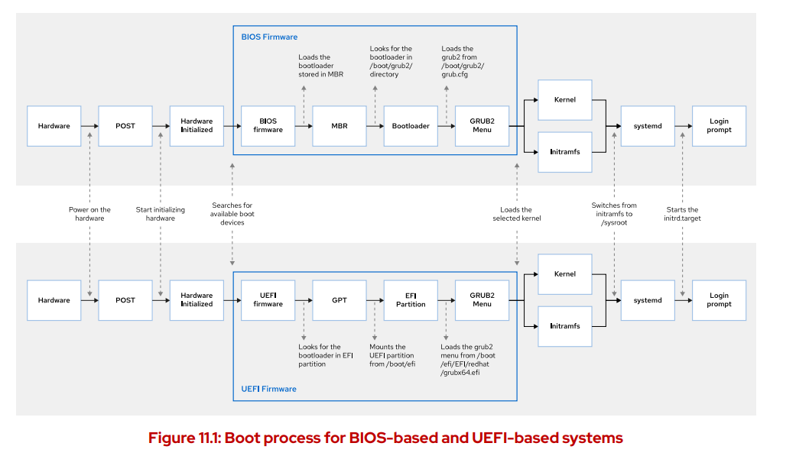

Linux Boot Process:-
1. Press the Power on
2. System Firmware gets loaded.Either BIOS (legacy) or UEFI(Latent).We can configure the UEFI or BIOS typically
   by pressing F2 button immediately after power-on.
   BIOS: Basic Input Output System, it uses MBR partition scheme.
   UEFI: Unified Extended Firmware Interface, it uses GPT(GUID Partition table) scheme
3. System firmware runs POST: Power on Self Test (checks the all connected hardware like:-cpu,ram,
  keyboard,system-clock,storage is working perfectly).If any issue,then shows ERROR message on screen.
4. Then, system firmware finds the Boot Loader. For this it checks on order of all the available bootable devices.
  This is configured in BIOS/UEFI in a boot order section.
  For BIOS: it lives in the first little chunk of the hard drive called Master Boot Record.
  For UEFI: It lives in the separate (usually 1st) partition in .efi boot loader file.This partition is 100Mb.
5. Once the boot loader is found(usually GRUB2 Grand Unified Boot Loader), its loaded into the memory. As below:-
   for BIOS: GRUB2 loads its configuration from /boot/grub2/grub.cfg
   for UEFI: GRUB2 loads its configuration from /boot/efi/EFI/redhat/grub.cfg
   Then this config shows a GUI option to choose which kernal to boot.
6. After the kernel is selected.The boot loader loads the OS Kernal and initramfs from the disk into the memory.
   OS kernel: The kernal initializes all the hardware and starts the process of /sbin/init as PID-1 which is systemd.
   initramfs: It contains the archive kernel modules for all the hardwares.It gets loaded during the kernel start time.
7. Systemd loads the selected/default target found at  /etc/systemd/system/default.target to choose the mode in which
  to be booted:
  a. GUI: graphical.target
  a. Multi User: multi-user.target
  c. Rescue: rescue.target . sulogin prompt, basic system initialization completed.
  d. Emergenc: emergency.target. sulogin prompt, initramfs pivot complete, and system root mounted on / read only.

8. Refernce: https://youtu.be/XpFsMB6FoOs?si=-YhS2q7072QQm2vr
   RHCSA: Chapter-11 Select the boot target.
 